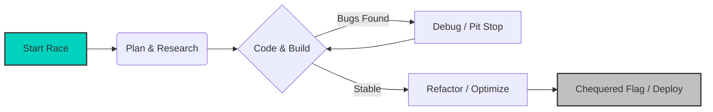

<!-- F1 Theme GitHub Profile -->

# 🏎️ LIGHTS OUT AND AWAY WE GO! 🏁

<!-- Dynamic Mercedes F1 GIF -->

 

<!-- Driver Stats Table -->
<table>
  <tr>
    <th align="center">🏁 Driver Profile</th>
    <th align="center">📍 Circuit Data</th>
    <th align="center">🏎️ Constructor</th>
  </tr>
  <tr>
    <td align="center">
      <b>Soufiane Jammali</b> 
      <i>Full Stack Developer</i>
    </td>
    <td align="center">
      <b>Khouribga, Morocco</b> 
      <i>1337 School (42 Network)</i>
    </td>
    <td align="center">
      <b>Team HMSTR63</b> 
      <i>Circle 5 - C++ Era</i>
    </td>
  </tr>
</table>

---

### 📊 Telemetry Data (GitHub Stats)

  
  

---

### 🛠️ Car Setup (Tech Stack & Tools)

<table align="center">
  <tr>
    <td align="center" width="90">
       
      <b>Engine</b>
    </td>
    <td align="center" width="90">
       
      <b>Aerodynamics</b>
    </td>
    <td align="center" width="90">
       
      <b>Pit Crew</b>
    </td>
  </tr>
</table>

 

<!-- Pit Stop GIF -->

---

### 🏆 Grand Prix Results (Projects)

| 🚥 Status | 🏎️ Project | 🔧 Tech Spec | 📝 Race Report (Description) |
| :---: | :--- | :--- | :--- |
| 🚀 **Lap 5** | **CPP Modules 05-09** | `C++98` | Mastering deep Object-Oriented Programming concepts. |
| 🚧 **Pit Lane** | **Inception** | `Docker`, `Virtualization` | System administration and containerization infrastructure. |
| 🏁 **P1** | **cub3d** | `C`, `Raycasting` | A Wolfenstein 3D-inspired game engine. |
| 🏁 **P1** | **minishell** | `C`, `Bash` | Recreating a shell with pipes, redirections, and signals. |
| 🏁 **P1** | **push_swap** | `C`, `Algorithms` | Optimized data sorting using stacks. |

---

### 🧠 Race Strategy (Workflow)

---

### 📻 Team Radio (Connect)

  

<!-- Moving Car Footer -->

 

<i>"I don't design clothes. I design dreams." - Ralph Lauren (But I design Code.)</i> 
<i>"Still I Rise." - Lewis Hamilton</i>

